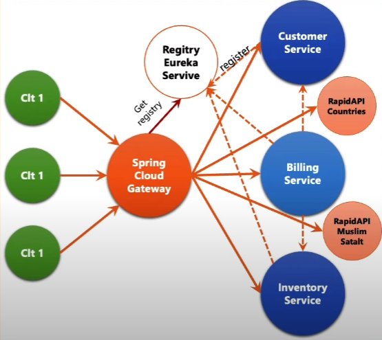

# Microservices Architecture ECOM usecase

Ce référentiel contient une démonstration d'architecture à microservices implémentée à l'aide de Spring Cloud et d'autres technologies connexes. Les microservices suivants ont été créés pour illustrer différentes fonctionnalités :

1. **customer-service :** Gère les informations liées aux clients.
2. **inventory-service :** Gère les informations liées aux produits.
3. **spring-cloud-gateway :** Une passerelle qui permet de gérer le routage entre les différents services.
4. **Configuration statique du système de routage :** Configuration initiale statique des routes pour la passerelle.
5. **eureka-discovery-service :** Service d'annuaire Eureka Discovery pour la découverte automatique des services.
6. **Configuration dynamique des routes :** Mise en place de la configuration dynamique des routes pour la passerelle.
7. **billing-service :** Service de facturation utilisant Open Feign pour la communication avec d'autres services.
